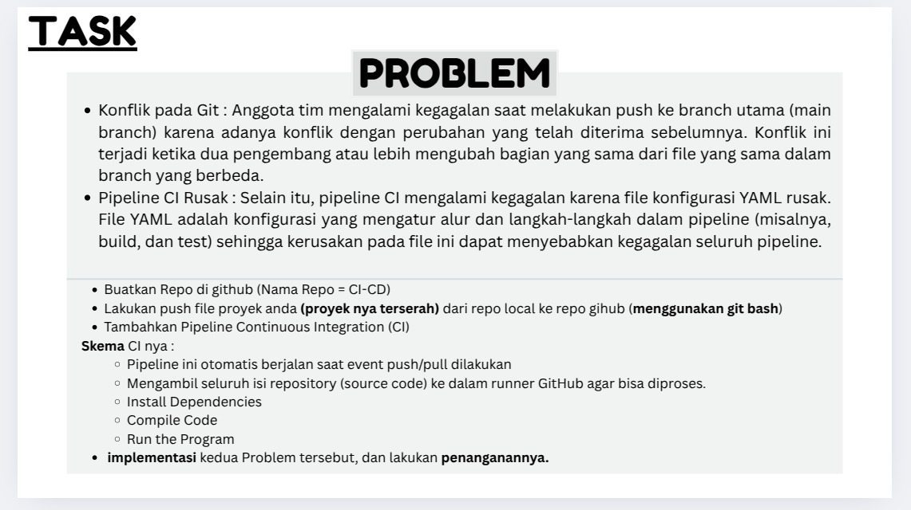

# Kasus CI Pada Aplikasi NodeJs

### Workflow Konflik Pada Git

1. Initial commit pada master branch.

2. Buat pipeline CI pada Github Actions. Jalankan CI saat event commit dan accept pull request pada master branch.

3. Mengubah fitur about dan commit pada branch `feature/about` dan menambah fitur user pada branch `feature/user`.

4. Merge `feature/about` ke `master`, kemudian merge `feature/user` ke `master`.

5. Merge conflict saat merge `feature/user` ke `master`, karena developer yang bekerja pada fitur user mengubah sedikit kode pada fitur about untuk penyesuaian.

6. Menangani merge conflict.

### Workflow Pipeline CI Rusak

1. Pipeline CI sudah dibuat sebelumnya.

2. Ternyata ada 1 developer yang kurang fokus dan mengubah konfigurasi pipeline CI.

3. Pipeline CI rusak, CI tidak jalan.

4. Menangani pipeline Ci yang rusak dengan melakukan commit baru dengan melakukan fix pada konfigurasi file.
